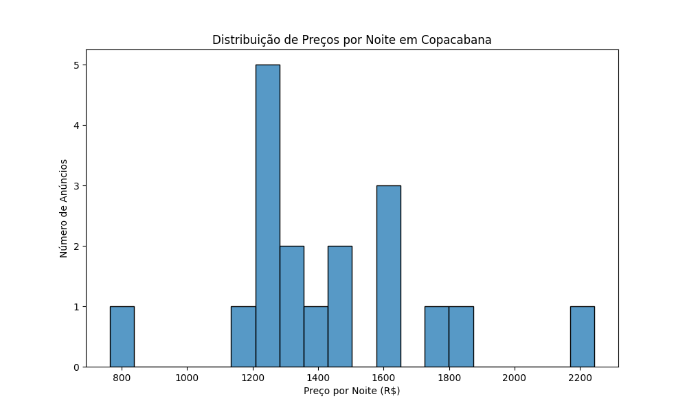
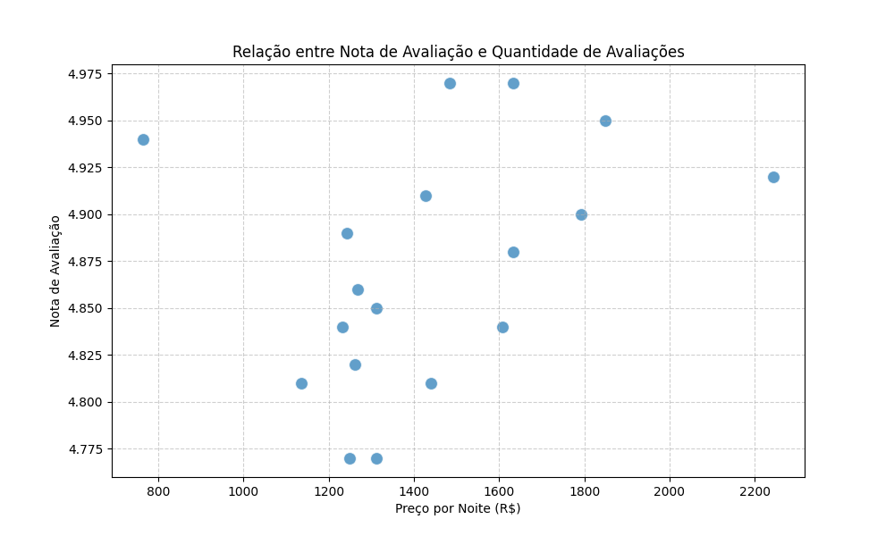
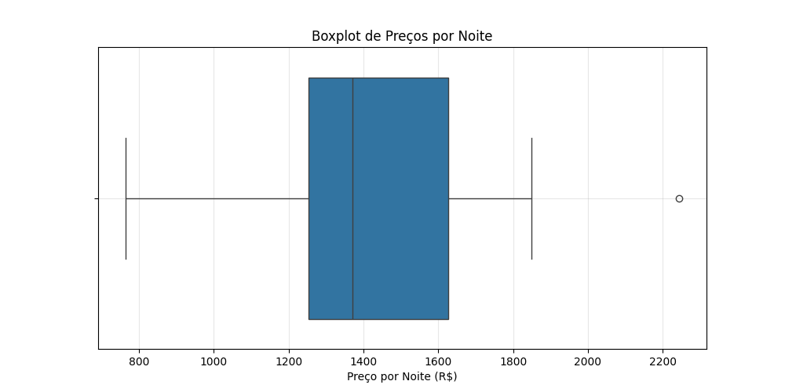

# 📊 Relatório de Análise de Dados - Airbnb Copacabana

## 1. Introdução

Este relatório apresenta os principais resultados obtidos a partir de dados coletados da plataforma Airbnb. A coleta foi feita no dia **23 de julho de 2025**, utilizando técnicas de **web scraping** com as bibliotecas `Selenium` e `BeautifulSoup`.

A amostra é composta por **18 anúncios** de acomodações localizadas em **Copacabana, Rio de Janeiro**, para estadias **flexíveis de uma semana no mês de dezembro de 2025**.

> ⚠️ Nota: Devido à natureza dinâmica do Airbnb, os dados representam apenas uma visão momentânea do site. Os resultados não refletem o panorama completo da plataforma.

---

## 2. Etapas do Projeto

O projeto seguiu as seguintes etapas:

- **Coleta de dados** via scraping com Selenium e BeautifulSoup.
- **Transformação dos dados** em um script ETL (`etl_airbnb.py`) para padronizar e limpar os valores.
- **Análise exploratória (EDA)** e visualização com `Pandas`, `Matplotlib` e `Seaborn`.

---

## 3. Limpeza e Transformações

Durante a transformação dos dados:

- A coluna `avaliacao` foi dividida em duas: `nota_avaliacao` (ex: 4.98) e `qtd_avaliacao` (ex: 145).
- A coluna `preco_noite` teve o símbolo `R$` removido e os valores convertidos para `float`.

---

## 4. Análises Realizadas

### 📌 Distribuição de preços por noite

A distribuição mostra que a maioria dos anúncios apresenta valores entre **R$1.200 e R$1.700** por noite, sugerindo essa faixa como o padrão de mercado na amostra observada.

Ainda assim, destaca-se um anúncio com preço de **R$765**, sendo o **único abaixo de R$1.000**, e um com **R$2.243**, figurando como o mais caro — indícios claros de **disparidade nos preços**.

---

### 📌 Correlação entre preço e nota de avaliação

Apesar de todos os anúncios possuírem notas acima de 4.7, não foi identificada correlação visível entre o preço da diária e a nota da avaliação.

---

### 📌 Quantidade de avaliações vs preço por noite

Também não se observa correlação clara entre a popularidade (número de avaliações) e o preço. A dispersão dos pontos sugere variações de mercado independentes da nota ou da frequência de reservas.

---

O boxplot revela a presença de **outliers** na distribuição de preços das acomodações. O valor mais alto encontrado foi de **R$2.243 por noite**, enquanto o mais baixo foi de **R$765**, sendo este o **único anúncio abaixo de R$1.000**. Esses extremos indicam uma certa disparidade nos preços, mas a maioria das acomodações se concentra na faixa de **R$1.200 a R$1.700**, refletindo uma tendência central no mercado de hospedagens em Copacabana no período analisado.

---

## 5. Considerações Finais

- O volume reduzido de dados limita a profundidade das análises estatísticas e correlações.
- Para análises mais robustas, seria necessária a coleta de um número maior de anúncios (idealmente, 100+).
- A modularização do projeto em scripts de scraping, ETL e notebook de análise facilita futuras atualizações e reuso do pipeline.
- O projeto cumpre seu papel educacional ao demonstrar a aplicação de scraping, limpeza de dados e EDA em Python.

---

## 📌 Próximos passos (futuros)

- Ampliar a quantidade de anúncios coletados.
- Automatizar o scraping para diferentes bairros ou faixas de preço.
- Explorar análises com dados temporais (disponibilidade, sazonalidade, etc).
